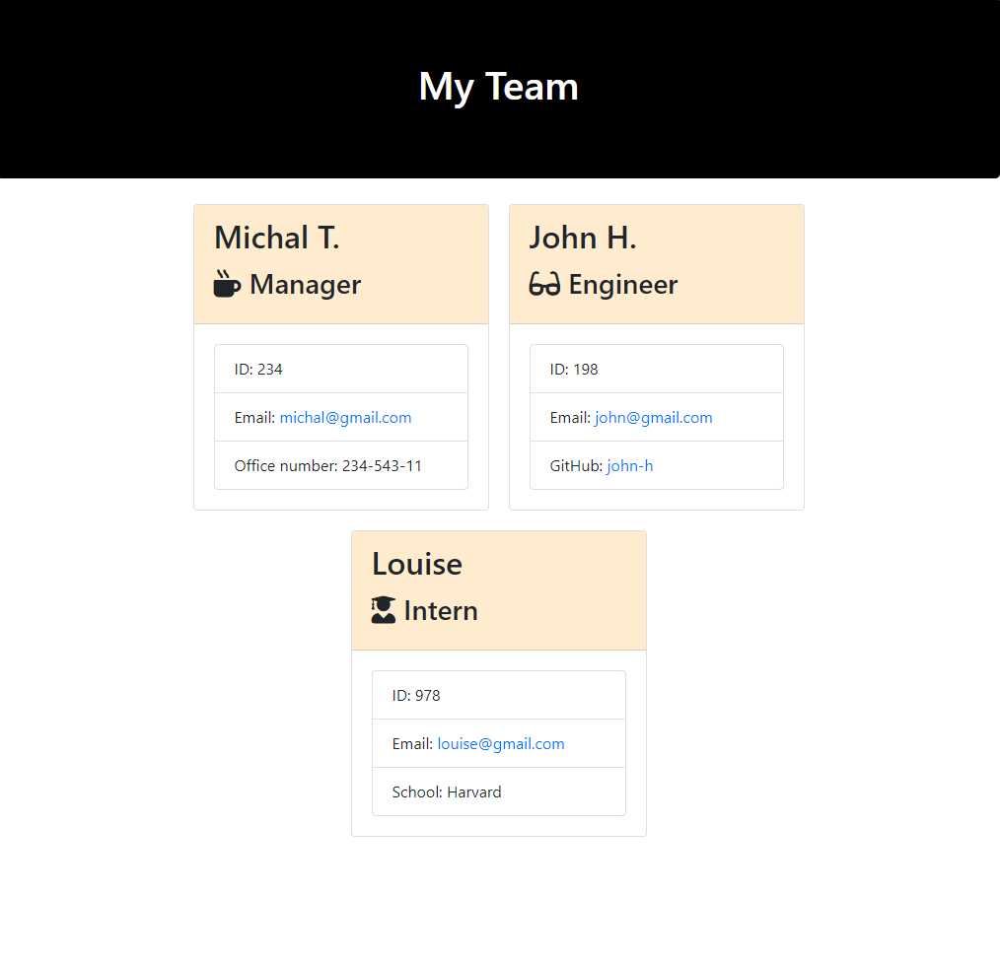

# Team-profile-generator

## Description

The aim of this project is to generate an HTML file that displays a team roster. Team members are added through the command line interface. After the team is built, the HTML file is automatically generated to include the added members.

## Features

Dynamic Team Generation: Users can team members, including managers, engineers, and interns. Each team member type has specific information associated with them (like GitHub username for engineers and school for interns).

## Technologies used

HTML, Bootstrap, Inquirer, Jest, Javascript, Node.js, CSS

## Screenshot

## Credits

N/A

## Licence

This project is licensed under the MIT License - see the [LICENSE](LICENSE) file for details.